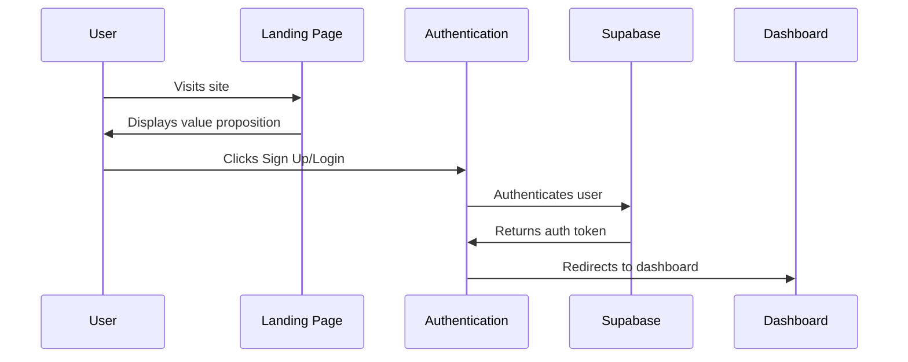
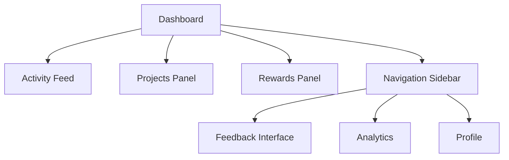
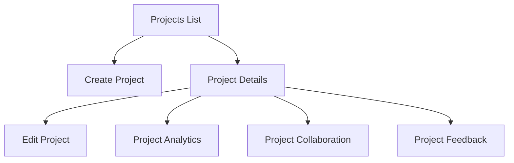
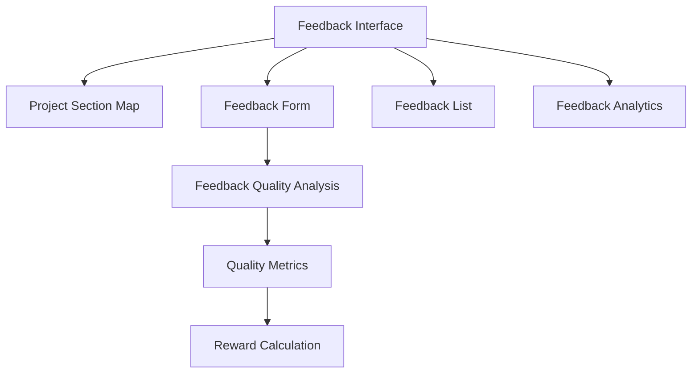
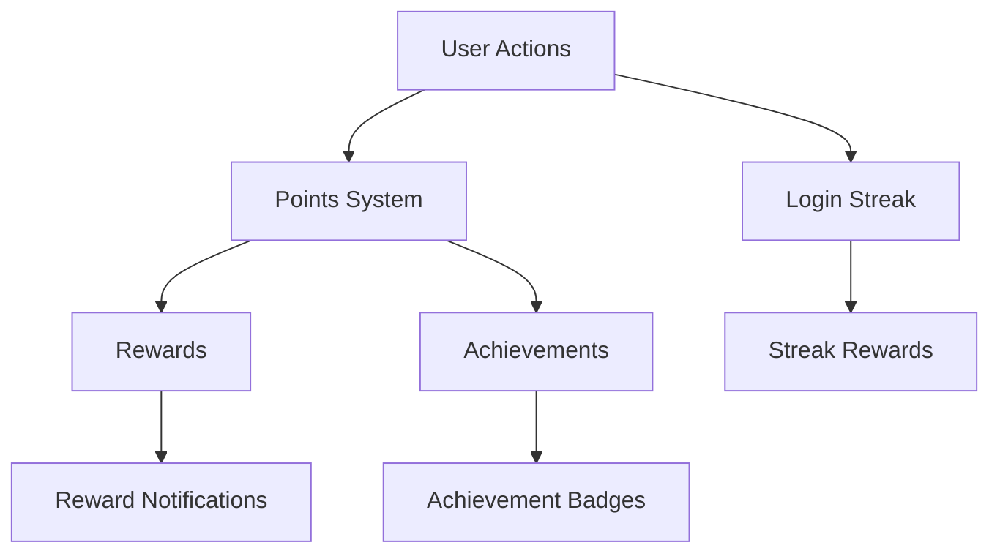
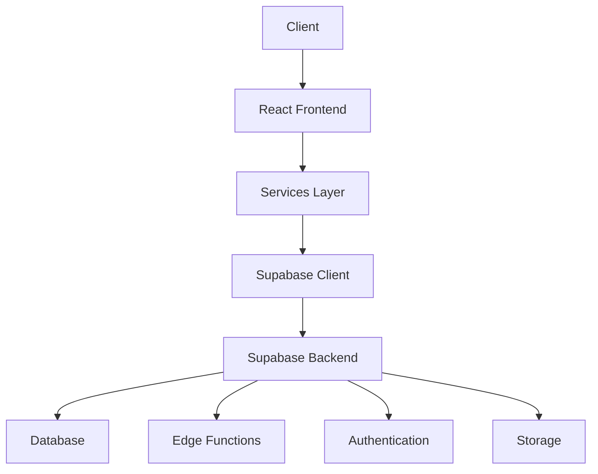
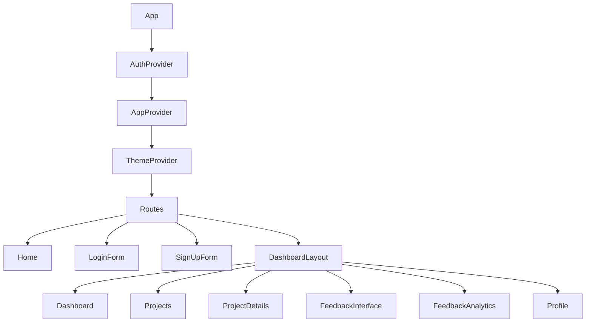
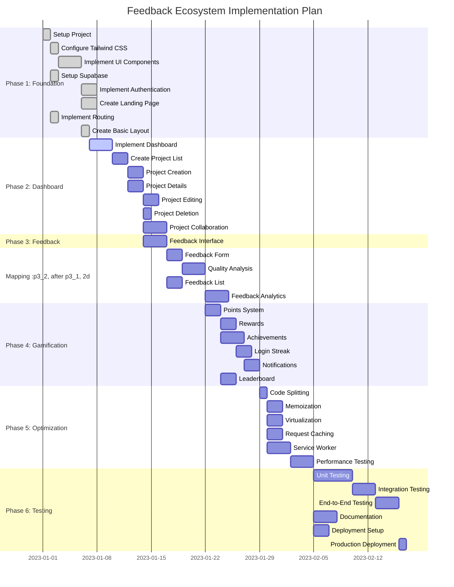

# Feedback Ecosystem Platform - Product Requirements Document

## Executive Summary

The Feedback Ecosystem Platform is a gamified feedback system connecting creators with feedback providers through an incentivized, reward-based approach. This document outlines the comprehensive requirements, architecture, implementation plan, and performance optimization strategies for bringing the platform to production.

## Table of Contents

1. [System Overview](#system-overview)
2. [Customer Journey](#customer-journey)
3. [Architecture Analysis](#architecture-analysis)
4. [Component Analysis](#component-analysis)
5. [Performance Optimization](#performance-optimization)
6. [Implementation Plan](#implementation-plan)
7. [Tracking System](#tracking-system)
8. [Dependencies](#dependencies)
9. [Future Enhancements](#future-enhancements)

## System Overview

The Feedback Ecosystem Platform consists of five core modules:

1. **Authentication & Landing**: User onboarding, authentication, and initial engagement
2. **Dashboard Experience**: Central hub for user activity and navigation
3. **Project Management**: Creation, editing, and management of projects
4. **Feedback System**: Collection, analysis, and presentation of feedback
5. **Gamification Elements**: Points, rewards, achievements, and incentives

### Current Implementation Status

| Module | Status | Completion % | Key Components |
|--------|--------|--------------|----------------|
| Authentication & Landing | Implemented | 95% | LoginForm, SignUpForm, Home |
| Dashboard Experience | Implemented | 90% | Dashboard, Sidebar, ActivityFeed |
| Project Management | Implemented | 85% | Projects, ProjectDetails, ProjectEditDialog |
| Feedback System | Partially Implemented | 75% | FeedbackInterface, FeedbackForm, FeedbackAnalytics |
| Gamification Elements | Partially Implemented | 70% | RewardsPanel, FeedbackQualityIndicator, AwardToastListener |

## Customer Journey

### Authentication & Landing



#### Current Implementation

The authentication flow is implemented using Supabase authentication with email/password and social login options. The landing page showcases the platform's value proposition with feature cards and testimonials.

#### Performance Optimization

1. **Lazy Loading Authentication Components**

```typescript
// Current implementation
import LoginForm from "./components/auth/LoginForm";
import SignUpForm from "./components/auth/SignUpForm";

// Optimized implementation
const LoginForm = React.lazy(() => import("./components/auth/LoginForm"));
const SignUpForm = React.lazy(() => import("./components/auth/SignUpForm"));
```

2. **Preloading Authentication Forms**

```typescript
// Add to Home component
useEffect(() => {
  const preloadAuthForms = () => {
    import("./components/auth/LoginForm");
    import("./components/auth/SignUpForm");
  };
  
  // Preload after initial render
  const timer = setTimeout(preloadAuthForms, 2000);
  return () => clearTimeout(timer);
}, []);
```

3. **Optimizing Supabase Authentication**

```typescript
// Implement persistent session storage
const { data: { session } } = await supabase.auth.getSession();
if (session) {
  // User is already authenticated, skip login
  navigate('/dashboard');
}
```

### Dashboard Experience



#### Current Implementation

The dashboard serves as the central hub for user activity, displaying recent actions, project updates, and reward progress. The navigation sidebar provides access to different sections of the application.

#### Performance Optimization

1. **Virtualized Lists for Activity Feed**

```typescript
import { useVirtualizer } from '@tanstack/react-virtual';

const ActivityFeed = ({ activities }) => {
  const parentRef = useRef(null);
  
  const rowVirtualizer = useVirtualizer({
    count: activities.length,
    getScrollElement: () => parentRef.current,
    estimateSize: () => 60,
  });
  
  return (
    <div ref={parentRef} className="h-[400px] overflow-auto">
      <div
        style={{
          height: `${rowVirtualizer.getTotalSize()}px`,
          position: 'relative',
        }}
      >
        {rowVirtualizer.getVirtualItems().map((virtualItem) => (
          <div
            key={virtualItem.key}
            style={{
              position: 'absolute',
              top: 0,
              left: 0,
              width: '100%',
              height: `${virtualItem.size}px`,
              transform: `translateY(${virtualItem.start}px)`,
            }}
          >
            <ActivityItem activity={activities[virtualItem.index]} />
          </div>
        ))}
      </div>
    </div>
  );
};
```

2. **Memoization of Dashboard Components**

```typescript
const MemoizedActivityFeed = React.memo(ActivityFeed);
const MemoizedRewardsPanel = React.memo(RewardsPanel);

const Dashboard = () => {
  // Component logic
  
  return (
    <div className="dashboard-container">
      <MemoizedActivityFeed activities={activities} />
      <MemoizedRewardsPanel rewards={rewards} />
      {/* Other components */}
    </div>
  );
};
```

3. **Incremental Loading of Dashboard Data**

```typescript
const Dashboard = () => {
  const [activities, setActivities] = useState([]);
  const [rewards, setRewards] = useState([]);
  const [isLoadingActivities, setIsLoadingActivities] = useState(true);
  const [isLoadingRewards, setIsLoadingRewards] = useState(true);
  
  useEffect(() => {
    const loadActivities = async () => {
      setIsLoadingActivities(true);
      const data = await activityService.getRecentActivities();
      setActivities(data);
      setIsLoadingActivities(false);
    };
    
    loadActivities();
  }, []);
  
  useEffect(() => {
    const loadRewards = async () => {
      setIsLoadingRewards(true);
      const data = await rewardsService.getUserRewards();
      setRewards(data);
      setIsLoadingRewards(false);
    };
    
    loadRewards();
  }, []);
  
  return (
    <div className="dashboard-container">
      {isLoadingActivities ? <ActivityFeedSkeleton /> : <ActivityFeed activities={activities} />}
      {isLoadingRewards ? <RewardsPanelSkeleton /> : <RewardsPanel rewards={rewards} />}
      {/* Other components */}
    </div>
  );
};
```

### Project Management



#### Current Implementation

The project management module allows users to create, edit, and manage projects. Projects can be shared with collaborators, and feedback can be collected from users.

#### Performance Optimization

1. **Optimized Project List Rendering**

```typescript
const ProjectsList = ({ projects }) => {
  // Use windowing for large lists
  return (
    <div className="projects-grid">
      {projects.map((project) => (
        <ProjectCard 
          key={project.id} 
          project={project} 
          // Only load thumbnail when in viewport
          lazyLoadThumbnail={true}
        />
      ))}
    </div>
  );
};

// ProjectCard component with lazy loading
const ProjectCard = ({ project, lazyLoadThumbnail }) => {
  const cardRef = useRef(null);
  const [isVisible, setIsVisible] = useState(false);
  
  useEffect(() => {
    if (!lazyLoadThumbnail) {
      setIsVisible(true);
      return;
    }
    
    const observer = new IntersectionObserver(
      ([entry]) => {
        if (entry.isIntersecting) {
          setIsVisible(true);
          observer.disconnect();
        }
      },
      { threshold: 0.1 }
    );
    
    if (cardRef.current) {
      observer.observe(cardRef.current);
    }
    
    return () => observer.disconnect();
  }, [lazyLoadThumbnail]);
  
  return (
    <div ref={cardRef} className="project-card">
      {isVisible ? (
        
      ) : (
        <div className="thumbnail-placeholder" />
      )}
      {/* Rest of card content */}
    </div>
  );
};
```

2. **Optimized Project Data Loading**

```typescript
const ProjectDetails = () => {
  const { projectId } = useParams();
  const [project, setProject] = useState(null);
  const [collaborators, setCollaborators] = useState([]);
  const [feedback, setFeedback] = useState([]);
  
  // Use React Query for data fetching with caching
  const { data: projectData, isLoading: isLoadingProject } = useQuery(
    ['project', projectId],
    () => projectService.getProjectById(projectId),
    { staleTime: 5 * 60 * 1000 } // 5 minutes
  );
  
  const { data: collaboratorsData, isLoading: isLoadingCollaborators } = useQuery(
    ['collaborators', projectId],
    () => projectService.getProjectCollaborators(projectId),
    { staleTime: 5 * 60 * 1000 } // 5 minutes
  );
  
  const { data: feedbackData, isLoading: isLoadingFeedback } = useQuery(
    ['feedback', projectId],
    () => feedbackService.getProjectFeedback(projectId),
    { staleTime: 5 * 60 * 1000 } // 5 minutes
  );
  
  useEffect(() => {
    if (projectData) setProject(projectData);
    if (collaboratorsData) setCollaborators(collaboratorsData);
    if (feedbackData) setFeedback(feedbackData);
  }, [projectData, collaboratorsData, feedbackData]);
  
  // Component rendering
};
```

3. **Optimized Project Editing**

```typescript
const ProjectEditDialog = ({ project, onSave }) => {
  // Use form library with validation
  const { register, handleSubmit, formState: { errors, isDirty } } = useForm({
    defaultValues: {
      title: project?.title || '',
      description: project?.description || '',
      // Other fields
    }
  });
  
  // Only enable save button if form is dirty
  const isSaveDisabled = !isDirty;
  
  // Debounce save function to prevent multiple rapid saves
  const debouncedSave = useCallback(
    debounce((data) => onSave(data), 500),
    [onSave]
  );
  
  const onSubmit = (data) => {
    debouncedSave(data);
  };
  
  // Component rendering
};
```

### Feedback System



#### Current Implementation

The feedback system allows users to provide feedback on specific sections of a project. Feedback is analyzed for quality, and rewards are calculated based on the quality metrics.

#### Performance Optimization

1. **Optimized Feedback Quality Analysis**

```typescript
// Move heavy computation to a web worker
// feedback-worker.js
self.addEventListener('message', async (e) => {
  const { content } = e.data;
  
  // Perform quality analysis
  const metrics = analyzeFeedbackQuality(content);
  
  self.postMessage(metrics);
});

function analyzeFeedbackQuality(content) {
  // Analysis logic
  return {
    specificityScore: calculateSpecificityScore(content),
    actionabilityScore: calculateActionabilityScore(content),
    noveltyScore: calculateNoveltyScore(content),
    sentiment: calculateSentiment(content),
  };
}

// In the component
const FeedbackForm = () => {
  const [feedbackText, setFeedbackText] = useState('');
  const [qualityMetrics, setQualityMetrics] = useState(null);
  const workerRef = useRef(null);
  
  useEffect(() => {
    workerRef.current = new Worker(new URL('./feedback-worker.js', import.meta.url));
    
    workerRef.current.addEventListener('message', (e) => {
      setQualityMetrics(e.data);
    });
    
    return () => workerRef.current.terminate();
  }, []);
  
  // Debounce analysis to avoid excessive computation
  useEffect(() => {
    const timer = setTimeout(() => {
      if (feedbackText.length > 20) {
        workerRef.current.postMessage({ content: feedbackText });
      }
    }, 500);
    
    return () => clearTimeout(timer);
  }, [feedbackText]);
  
  // Component rendering
};
```

2. **Optimized Feedback Rendering**

```typescript
const FeedbackList = ({ feedback }) => {
  // Group feedback by section for more efficient rendering
  const feedbackBySection = useMemo(() => {
    return feedback.reduce((acc, item) => {
      const sectionId = item.sectionId || 'general';
      if (!acc[sectionId]) {
        acc[sectionId] = [];
      }
      acc[sectionId].push(item);
      return acc;
    }, {});
  }, [feedback]);
  
  return (
    <div className="feedback-list">
      {Object.entries(feedbackBySection).map(([sectionId, items]) => (
        <FeedbackSection 
          key={sectionId} 
          sectionId={sectionId} 
          items={items} 
        />
      ))}
    </div>
  );
};

// Memoize individual feedback items
const FeedbackItem = React.memo(({ item }) => {
  // Render feedback item
});
```

3. **Optimized Feedback Analytics**

```typescript
const FeedbackAnalytics = ({ projectId }) => {
  // Use server-side aggregation instead of client-side
  const { data, isLoading } = useQuery(
    ['feedback-analytics', projectId],
    () => feedbackAnalyticsService.getFeedbackAnalytics({ projectId }),
    { staleTime: 5 * 60 * 1000 } // 5 minutes
  );
  
  // Pre-calculate chart data on the server
  // This reduces client-side computation
  
  // Component rendering
};
```

### Gamification Elements



#### Current Implementation

The gamification system rewards users for various actions, including providing feedback, logging in daily, and achieving specific milestones.

#### Performance Optimization

1. **Optimized Rewards Calculation**

```typescript
// Move rewards calculation to the server
// In the service
export const rewardsService = {
  async processReward(params) {
    const { userId, activityType, metadata } = params;
    
    // Call server-side function instead of calculating client-side
    const { data, error } = await supabase.functions.invoke(
      'process-reward',
      { body: { userId, activityType, metadata } }
    );
    
    if (error) throw error;
    return data;
  }
};

// In the edge function (process-reward/index.ts)
Deno.serve(async (req) => {
  const { userId, activityType, metadata } = await req.json();
  
  // Calculate rewards server-side
  const points = calculatePoints(activityType, metadata);
  
  // Update user points in database
  const { data, error } = await supabase
    .from('users')
    .update({ points: supabase.sql`points + ${points}` })
    .eq('id', userId)
    .select('points')
    .single();
  
  if (error) {
    return new Response(
      JSON.stringify({ error: error.message }),
      { headers: corsHeaders, status: 400 }
    );
  }
  
  return new Response(
    JSON.stringify({ points, totalPoints: data.points }),
    { headers: corsHeaders, status: 200 }
  );
});
```

2. **Optimized Achievement Tracking**

```typescript
// Batch achievement checks
export const achievementService = {
  async checkAchievements(userId) {
    // Call server-side function to check all achievements at once
    const { data, error } = await supabase.functions.invoke(
      'check-achievements',
      { body: { userId } }
    );
    
    if (error) throw error;
    return data;
  }
};

// In the edge function (check-achievements/index.ts)
Deno.serve(async (req) => {
  const { userId } = await req.json();
  
  // Get user data needed for achievement checks
  const { data: userData, error: userError } = await supabase
    .from('users')
    .select('points, feedback_count, login_streak')
    .eq('id', userId)
    .single();
  
  if (userError) {
    return new Response(
      JSON.stringify({ error: userError.message }),
      { headers: corsHeaders, status: 400 }
    );
  }
  
  // Check all achievements in parallel
  const achievementChecks = [
    checkPointsAchievements(userId, userData.points),
    checkFeedbackAchievements(userId, userData.feedback_count),
    checkStreakAchievements(userId, userData.login_streak),
  ];
  
  const results = await Promise.all(achievementChecks);
  const newAchievements = results.flat().filter(Boolean);
  
  return new Response(
    JSON.stringify({ achievements: newAchievements }),
    { headers: corsHeaders, status: 200 }
  );
});
```

3. **Optimized Reward Notifications**

```typescript
// Use a notification queue to prevent UI jank
const useRewardNotifications = () => {
  const [queue, setQueue] = useState([]);
  const [currentNotification, setCurrentNotification] = useState(null);
  const [isShowing, setIsShowing] = useState(false);
  
  // Add notification to queue
  const addNotification = useCallback((notification) => {
    setQueue(prev => [...prev, notification]);
  }, []);
  
  // Process queue
  useEffect(() => {
    if (queue.length > 0 && !isShowing) {
      const nextNotification = queue[0];
      setCurrentNotification(nextNotification);
      setIsShowing(true);
      setQueue(prev => prev.slice(1));
    }
  }, [queue, isShowing]);
  
  // Handle notification dismissal
  const handleDismiss = useCallback(() => {
    setIsShowing(false);
    setCurrentNotification(null);
  }, []);
  
  return {
    currentNotification,
    isShowing,
    addNotification,
    handleDismiss,
  };
};
```

## Architecture Analysis

### Current Architecture



### Proposed Architecture Improvements

1. **Implement Service Worker for Offline Support**

```typescript
// In src/service-worker.js
self.addEventListener('install', (event) => {
  event.waitUntil(
    caches.open('feedback-ecosystem-v1').then((cache) => {
      return cache.addAll([
        '/',
        '/index.html',
        '/static/js/main.chunk.js',
        '/static/js/vendors.chunk.js',
        '/static/css/main.chunk.css',
        // Add other static assets
      ]);
    })
  );
});

self.addEventListener('fetch', (event) => {
  event.respondWith(
    caches.match(event.request).then((response) => {
      return response || fetch(event.request).then((fetchResponse) => {
        // Cache GET requests for static assets and API responses
        if (event.request.method === 'GET' && 
            (event.request.url.includes('/static/') || 
             event.request.url.includes('/api/'))) {
          return caches.open('feedback-ecosystem-v1').then((cache) => {
            cache.put(event.request, fetchResponse.clone());
            return fetchResponse;
          });
        }
        return fetchResponse;
      });
    })
  );
});
```

2. **Implement API Request Batching**

```typescript
// In src/services/api.ts
export const batchRequests = async (requests) => {
  // Group requests by endpoint
  const groupedRequests = requests.reduce((acc, request) => {
    const { endpoint } = request;
    if (!acc[endpoint]) {
      acc[endpoint] = [];
    }
    acc[endpoint].push(request);
    return acc;
  }, {});
  
  // Process each group in parallel
  const results = await Promise.all(
    Object.entries(groupedRequests).map(async ([endpoint, requests]) => {
      // If there's only one request, process normally
      if (requests.length === 1) {
        const { params } = requests[0];
        return { endpoint, data: await processRequest(endpoint, params) };
      }
      
      // Otherwise, batch the requests
      const batchParams = requests.map(r => r.params);
      const batchData = await processBatchRequest(endpoint, batchParams);
      
      // Map batch results back to individual requests
      return {
        endpoint,
        data: batchData.map((data, index) => ({
          requestId: requests[index].id,
          data,
        })),
      };
    })
  );
  
  // Flatten and return results
  return results.reduce((acc, result) => {
    if (Array.isArray(result.data)) {
      result.data.forEach(item => {
        acc[item.requestId] = item.data;
      });
    } else {
      acc[result.endpoint] = result.data;
    }
    return acc;
  }, {});
};
```

3. **Implement State Management with Context API and Reducers**

```typescript
// In src/context/AppContext.tsx
import React, { createContext, useReducer, useContext } from 'react';

// Define initial state
const initialState = {
  user: null,
  projects: [],
  feedback: [],
  rewards: [],
  notifications: [],
  isLoading: false,
  error: null,
};

// Define action types
const ActionTypes = {
  SET_USER: 'SET_USER',
  SET_PROJECTS: 'SET_PROJECTS',
  ADD_PROJECT: 'ADD_PROJECT',
  UPDATE_PROJECT: 'UPDATE_PROJECT',
  DELETE_PROJECT: 'DELETE_PROJECT',
  SET_FEEDBACK: 'SET_FEEDBACK',
  ADD_FEEDBACK: 'ADD_FEEDBACK',
  SET_REWARDS: 'SET_REWARDS',
  ADD_REWARD: 'ADD_REWARD',
  ADD_NOTIFICATION: 'ADD_NOTIFICATION',
  REMOVE_NOTIFICATION: 'REMOVE_NOTIFICATION',
  SET_LOADING: 'SET_LOADING',
  SET_ERROR: 'SET_ERROR',
  CLEAR_ERROR: 'CLEAR_ERROR',
};

// Define reducer
const appReducer = (state, action) => {
  switch (action.type) {
    case ActionTypes.SET_USER:
      return { ...state, user: action.payload };
    case ActionTypes.SET_PROJECTS:
      return { ...state, projects: action.payload };
    case ActionTypes.ADD_PROJECT:
      return { ...state, projects: [...state.projects, action.payload] };
    case ActionTypes.UPDATE_PROJECT:
      return {
        ...state,
        projects: state.projects.map(project =>
          project.id === action.payload.id ? action.payload : project
        ),
      };
    case ActionTypes.DELETE_PROJECT:
      return {
        ...state,
        projects: state.projects.filter(project => project.id !== action.payload),
      };
    case ActionTypes.SET_FEEDBACK:
      return { ...state, feedback: action.payload };
    case ActionTypes.ADD_FEEDBACK:
      return { ...state, feedback: [...state.feedback, action.payload] };
    case ActionTypes.SET_REWARDS:
      return { ...state, rewards: action.payload };
    case ActionTypes.ADD_REWARD:
      return { ...state, rewards: [...state.rewards, action.payload] };
    case ActionTypes.ADD_NOTIFICATION:
      return {
        ...state,
        notifications: [...state.notifications, action.payload],
      };
    case ActionTypes.REMOVE_NOTIFICATION:
      return {
        ...state,
        notifications: state.notifications.filter(
          notification => notification.id !== action.payload
        ),
      };
    case ActionTypes.SET_LOADING:
      return { ...state, isLoading: action.payload };
    case ActionTypes.SET_ERROR:
      return { ...state, error: action.payload };
    case ActionTypes.CLEAR_ERROR:
      return { ...state, error: null };
    default:
      return state;
  }
};

// Create context
const AppContext = createContext();

// Create provider component
export const AppProvider = ({ children }) => {
  const [state, dispatch] = useReducer(appReducer, initialState);
  
  return (
    <AppContext.Provider value={{ state, dispatch }}>
      {children}
    </AppContext.Provider>
  );
};

// Create custom hook for using the context
export const useAppContext = () => {
  const context = useContext(AppContext);
  if (!context) {
    throw new Error('useAppContext must be used within an AppProvider');
  }
  return context;
};

// Create action creators
export const Actions = {
  setUser: (user) => ({ type: ActionTypes.SET_USER, payload: user }),
  setProjects: (projects) => ({ type: ActionTypes.SET_PROJECTS, payload: projects }),
  addProject: (project) => ({ type: ActionTypes.ADD_PROJECT, payload: project }),
  updateProject: (project) => ({ type: ActionTypes.UPDATE_PROJECT, payload: project }),
  deleteProject: (projectId) => ({ type: ActionTypes.DELETE_PROJECT, payload: projectId }),
  setFeedback: (feedback) => ({ type: ActionTypes.SET_FEEDBACK, payload: feedback }),
  addFeedback: (feedback) => ({ type: ActionTypes.ADD_FEEDBACK, payload: feedback }),
  setRewards: (rewards) => ({ type: ActionTypes.SET_REWARDS, payload: rewards }),
  addReward: (reward) => ({ type: ActionTypes.ADD_REWARD, payload: reward }),
  addNotification: (notification) => ({ type: ActionTypes.ADD_NOTIFICATION, payload: notification }),
  removeNotification: (notificationId) => ({ type: ActionTypes.REMOVE_NOTIFICATION, payload: notificationId }),
  setLoading: (isLoading) => ({ type: ActionTypes.SET_LOADING, payload: isLoading }),
  setError: (error) => ({ type: ActionTypes.SET_ERROR, payload: error }),
  clearError: () => ({ type: ActionTypes.CLEAR_ERROR }),
};
```

## Component Analysis

### Component Hierarchy



### Component Optimization

| Component | Issue | Optimization |
|-----------|-------|-------------|
| App.tsx | Excessive re-renders | Implement React.memo and useCallback |
| Dashboard | Heavy data loading | Implement incremental loading and virtualization |
| FeedbackInterface | Complex UI with many states | Split into smaller components with focused responsibilities |
| ProjectDetails | Multiple API calls | Batch API requests and implement caching |
| FeedbackAnalytics | Heavy computation for charts | Move computation to server-side or web worker |

## Performance Optimization

### Bundle Size Optimization

1. **Code Splitting**

```typescript
// In vite.config.ts
export default defineConfig({
  build: {
    rollupOptions: {
      output: {
        manualChunks: {
          'vendor': [
            'react',
            'react-dom',
            'react-router-dom',
          ],
          'ui': [
            '@radix-ui/react-accordion',
            '@radix-ui/react-alert-dialog',
            // Other UI components
          ],
          'charts': [
            'recharts',
          ],
        },
      },
    },
  },
});
```

2. **Tree Shaking**

```typescript
// Instead of importing the entire library
import { Button, Card, Avatar } from '@/components/ui';

// Import only what you need
import Button from '@/components/ui/button';
import Card from '@/components/ui/card';
import Avatar from '@/components/ui/avatar';
```

3. **Dynamic Imports**

```typescript
// In src/App.tsx
const Dashboard = React.lazy(() => import('./components/pages/Dashboard'));
const Projects = React.lazy(() => import('./components/pages/Projects'));
const FeedbackInterface = React.lazy(() => import('./components/pages/FeedbackInterface'));
const FeedbackAnalytics = React.lazy(() => import('./components/pages/FeedbackAnalytics'));
```

### Rendering Optimization

1. **Implement Virtualization for Lists**

```typescript
import { useVirtualizer } from '@tanstack/react-virtual';

const VirtualizedList = ({ items, renderItem }) => {
  const parentRef = useRef(null);
  
  const rowVirtualizer = useVirtualizer({
    count: items.length,
    getScrollElement: () => parentRef.current,
    estimateSize: () => 50,
  });
  
  return (
    <div ref={parentRef} className="h-[500px] overflow-auto">
      <div
        style={{
          height: `${rowVirtualizer.getTotalSize()}px`,
          position: 'relative',
        }}
      >
        {rowVirtualizer.getVirtualItems().map((virtualItem) => (
          <div
            key={virtualItem.key}
            style={{
              position: 'absolute',
              top: 0,
              left: 0,
              width: '100%',
              height: `${virtualItem.size}px`,
              transform: `translateY(${virtualItem.start}px)`,
            }}
          >
            {renderItem(items[virtualItem.index], virtualItem.index)}
          </div>
        ))}
      </div>
    </div>
  );
};
```

2. **Implement Memoization**

```typescript
const MemoizedComponent = React.memo(({ prop1, prop2, onAction }) => {
  // Component logic
  
  return (
    // JSX
  );
}, (prevProps, nextProps) => {
  // Custom comparison function
  return (
    prevProps.prop1 === nextProps.prop1 &&
    prevProps.prop2 === nextProps.prop2
  );
});
```

3. **Implement useCallback and useMemo**

```typescript
const Component = ({ items }) => {
  // Memoize expensive calculations
  const processedItems = useMemo(() => {
    return items.map(item => processItem(item));
  }, [items]);
  
  // Memoize event handlers
  const handleClick = useCallback((id) => {
    // Handle click
  }, []);
  
  return (
    <div>
      {processedItems.map(item => (
        <Item 
          key={item.id} 
          item={item} 
          onClick={handleClick} 
        />
      ))}
    </div>
  );
};
```

### Network Optimization

1. **Implement Request Caching**

```typescript
// In src/services/api.ts
const cache = new Map();

export const fetchWithCache = async (url, options = {}) => {
  const cacheKey = `${url}-${JSON.stringify(options)}`;
  
  // Check if we have a cached response
  if (cache.has(cacheKey)) {
    const { data, timestamp } = cache.get(cacheKey);
    const isExpired = Date.now() - timestamp > 5 * 60 * 1000; // 5 minutes
    
    if (!isExpired) {
      return data;
    }
  }
  
  // Fetch fresh data
  const response = await fetch(url, options);
  const data = await response.json();
  
  // Cache the response
  cache.set(cacheKey, {
    data,
    timestamp: Date.now(),
  });
  
  return data;
};
```

2. **Implement Prefetching**

```typescript
// In src/components/pages/Projects.tsx
const Projects = () => {
  // Component logic
  
  // Prefetch project details when hovering over a project card
  const prefetchProjectDetails = useCallback((projectId) => {
    projectService.getProjectById(projectId);
  }, []);
  
  return (
    <div className="projects-grid">
      {projects.map(project => (
        <div 
          key={project.id} 
          onMouseEnter={() => prefetchProjectDetails(project.id)}
        >
          <ProjectCard project={project} />
        </div>
      ))}
    </div>
  );
};
```

3. **Implement Connection Resilience**

```typescript
// In src/services/api.ts
export const resilientFetch = async (url, options = {}, retries = 3) => {
  try {
    const response = await fetch(url, options);
    if (!response.ok) {
      throw new Error(`HTTP error ${response.status}`);
    }
    return await response.json();
  } catch (error) {
    if (retries > 0) {
      // Exponential backoff
      const delay = 2 ** (3 - retries) * 1000;
      await new Promise(resolve => setTimeout(resolve, delay));
      return resilientFetch(url, options, retries - 1);
    }
    throw error;
  }
};
```

## Implementation Plan

### Phase 1: Foundation and Authentication (Weeks 1-2)

| Task | Description | Priority | Estimated Time | Dependencies |
|------|-------------|----------|----------------|-------------|
| Setup Project | Initialize project with Vite, React, and TypeScript | High | 1 day | None |
| Configure Tailwind CSS | Set up Tailwind CSS for styling | High | 0.5 day | Setup Project |
| Implement UI Components | Create base UI components using shadcn/ui | High | 3 days | Configure Tailwind CSS |
| Setup Supabase | Configure Supabase for authentication and database | High | 1 day | Setup Project |
| Implement Authentication | Create login and signup forms with Supabase auth | High | 2 days | Setup Supabase, Implement UI Components |
| Create Landing Page | Design and implement landing page | Medium | 2 days | Implement UI Components |
| Implement Routing | Set up React Router for navigation | High | 1 day | Setup Project |
| Create Basic Layout | Implement app layout with navigation | Medium | 1 day | Implement Routing, Implement UI Components |

### Phase 2: Dashboard and Project Management (Weeks 3-4)

| Task | Description | Priority | Estimated Time | Dependencies |
|------|-------------|----------|----------------|-------------|
| Implement Dashboard | Create dashboard with activity feed and stats | High | 3 days | Create Basic Layout |
| Create Project List | Implement project listing and filtering | High | 2 days | Implement Dashboard |
| Implement Project Creation | Create project creation form and logic | High | 2 days | Create Project List |
| Implement Project Details | Create project details page | High | 2 days | Create Project List |
| Implement Project Editing | Create project editing functionality | Medium | 2 days | Implement Project Details |
| Implement Project Deletion | Create project deletion functionality | Medium | 1 day | Implement Project Details |
| Implement Project Collaboration | Create project sharing and collaboration | Medium | 3 days | Implement Project Details |

### Phase 3: Feedback System (Weeks 5-6)

| Task | Description | Priority | Estimated Time | Dependencies |
|------|-------------|----------|----------------|-------------|
| Implement Feedback Interface | Create feedback collection interface | High | 3 days | Implement Project Details |
| Implement Section Mapping | Create project section mapping for targeted feedback | High | 2 days | Implement Feedback Interface |
| Implement Feedback Form | Create feedback submission form | High | 2 days | Implement Feedback Interface |
| Implement Feedback Quality Analysis | Create feedback quality analysis logic | High | 3 days | Implement Feedback Form |
| Implement Feedback List | Create feedback listing and filtering | Medium | 2 days | Implement Feedback Interface |
| Implement Feedback Analytics | Create feedback analytics dashboard | Medium | 3 days | Implement Feedback Quality Analysis |

### Phase 4: Gamification and Rewards (Weeks 7-8)

| Task | Description | Priority | Estimated Time | Dependencies |
|------|-------------|----------|----------------|-------------|
| Implement Points System | Create points calculation and tracking | High | 2 days | Implement Feedback Quality Analysis |
| Implement Rewards | Create rewards for user actions | High | 2 days | Implement Points System |
| Implement Achievements | Create achievement system | Medium | 3 days | Implement Points System |
| Implement Login Streak | Create login streak tracking and rewards | Medium | 2 days | Implement Rewards |
| Implement Notifications | Create notification system for rewards and achievements | Medium | 2 days | Implement Rewards, Implement Achievements |
| Implement Leaderboard | Create leaderboard for user rankings | Low | 2 days | Implement Points System |

### Phase 5: Performance Optimization (Weeks 9-10)

| Task | Description | Priority | Estimated Time | Dependencies |
|------|-------------|----------|----------------|-------------|
| Implement Code Splitting | Optimize bundle size with code splitting | High | 1 day | All previous phases |
| Implement Memoization | Optimize rendering with memoization | High | 2 days | All previous phases |
| Implement Virtualization | Optimize list rendering with virtualization | Medium | 2 days | All previous phases |
| Implement Request Caching | Optimize network requests with caching | Medium | 2 days | All previous phases |
| Implement Service Worker | Add offline support with service worker | Low | 3 days | All previous phases |
| Performance Testing | Test and optimize performance | High | 3 days | All previous tasks |

### Phase 6: Testing and Deployment (Weeks 11-12)

| Task | Description | Priority | Estimated Time | Dependencies |
|------|-------------|----------|----------------|-------------|
| Unit Testing | Write unit tests for components and services | High | 5 days | All previous phases |
| Integration Testing | Write integration tests for key workflows | High | 3 days | Unit Testing |
| End-to-End Testing | Write end-to-end tests for critical paths | Medium | 3 days | Integration Testing |
| Documentation | Create documentation for codebase and APIs | Medium | 3 days | All previous phases |
| Deployment Setup | Configure deployment pipeline | High | 2 days | All previous phases |
| Production Deployment | Deploy to production | High | 1 day | Deployment Setup |

## Tracking System

### Implementation Tracking Table

| Phase | Task | Status | Assigned To | Start Date | End Date | Notes |
|-------|------|--------|-------------|------------|----------|-------|
| 1 | Setup Project | Completed | Developer 1 | 2023-01-01 | 2023-01-01 | Project initialized with Vite, React, and TypeScript |
| 1 | Configure Tailwind CSS | Completed | Developer 1 | 2023-01-02 | 2023-01-02 | Tailwind CSS configured with custom theme |
| 1 | Implement UI Components | Completed | Developer 2 | 2023-01-03 | 2023-01-05 | Base UI components created using shadcn/ui |
| 1 | Setup Supabase | Completed | Developer 1 | 2023-01-06 | 2023-01-06 | Supabase configured for authentication and database |
| 1 | Implement Authentication | Completed | Developer 1 | 2023-01-09 | 2023-01-10 | Login and signup forms created with Supabase auth |
| 1 | Create Landing Page | Completed | Developer 2 | 2023-01-11 | 2023-01-12 | Landing page designed and implemented |
| 1 | Implement Routing | Completed | Developer 1 | 2023-01-13 | 2023-01-13 | React Router configured for navigation |
| 1 | Create Basic Layout | Completed | Developer 2 | 2023-01-16 | 2023-01-16 | App layout implemented with navigation |
| 2 | Implement Dashboard | In Progress | Developer 1 | 2023-01-17 | - | Dashboard with activity feed and stats |
| 2 | Create Project List | Not Started | Developer 2 | - | - | Project listing and filtering |
| 2 | Implement Project Creation | Not Started | Developer 1 | - | - | Project creation form and logic |
| 2 | Implement Project Details | Not Started | Developer 2 | - | - | Project details page |
| 2 | Implement Project Editing | Not Started | Developer 1 | - | - | Project editing functionality |
| 2 | Implement Project Deletion | Not Started | Developer 2 | - | - | Project deletion functionality |
| 2 | Implement Project Collaboration | Not Started | Developer 1 | - | - | Project sharing and collaboration |

### Progress Tracking Chart



### Issue Tracking

| Issue ID | Description | Priority | Status | Assigned To | Related Task | Notes |
|----------|-------------|----------|--------|-------------|--------------|-------|
| FE-001 | Authentication not working with social login | High | Open | Developer 1 | Implement Authentication | Need to configure OAuth providers in Supabase |
| FE-002 | Dashboard activity feed not updating in real-time | Medium | Open | Developer 1 | Implement Dashboard | Need to implement Supabase realtime subscriptions |
| FE-003 | UI components not consistent across pages | Medium | Open | Developer 2 | Implement UI Components | Need to create a design system |

## Dependencies

### External Dependencies

| Dependency | Version | Purpose | Alternatives |
|------------|---------|---------|-------------|
| React | 18.2.0 | UI library | Preact, Solid |
| React Router | 6.23.1 | Routing | TanStack Router |
| Tailwind CSS | 3.4.1 | Styling | Styled Components, Emotion |
| shadcn/ui | N/A | UI components | MUI, Chakra UI |
| Supabase | 2.45.6 | Backend services | Firebase, Appwrite |
| Recharts | 2.15.3 | Data visualization | Chart.js, D3.js |
| React Hook Form | 7.51.5 | Form handling | Formik, React Final Form |
| Zod | 3.23.8 | Schema validation | Yup, Joi |
| Framer Motion | 11.18.2 | Animations | React Spring, Motion One |
| Lucide React | 0.394.0 | Icons | React Icons, Heroicons |

### Internal Dependencies

| Component | Depends On | Purpose |
|-----------|------------|----------|
| App.tsx | AuthProvider, AppProvider, ThemeProvider | Application entry point |
| AuthProvider | Supabase | Authentication state management |
| AppProvider | React Context API | Application state management |
| Dashboard | ActivityFeed, RewardsPanel, ProjectsList | Dashboard page |
| FeedbackInterface | ProjectSectionMap, FeedbackForm, FeedbackList | Feedback collection interface |
| FeedbackAnalytics | Recharts | Feedback analytics visualization |

## Future Enhancements

### Short-term Enhancements (3-6 months)

1. **Implement Real-time Collaboration**

```typescript
// In src/services/collaboration.ts
export const collaborationService = {
  async subscribeToProjectChanges(projectId, callback) {
    const channel = supabase
      .channel(`project-${projectId}`)
      .on('postgres_changes', {
        event: '*',
        schema: 'public',
        table: 'projects',
        filter: `id=eq.${projectId}`,
      }, (payload) => {
        callback(payload.new);
      })
      .subscribe();
    
    return () => {
      supabase.removeChannel(channel);
    };
  },
  
  async subscribeToFeedbackChanges(projectId, callback) {
    const channel = supabase
      .channel(`feedback-${projectId}`)
      .on('postgres_changes', {
        event: '*',
        schema: 'public',
        table: 'feedback',
        filter: `project_id=eq.${projectId}`,
      }, (payload) => {
        callback(payload.new);
      })
      .subscribe();
    
    return () => {
      supabase.removeChannel(channel);
    };
  },
};
```

2. **Implement Advanced Analytics**

```typescript
// In src/services/analytics.ts
export const analyticsService = {
  async getProjectAnalytics(projectId) {
    const { data, error } = await supabase.functions.invoke(
      'project-analytics',
      { body: { projectId } }
    );
    
    if (error) throw error;
    return data;
  },
  
  async getUserAnalytics(userId) {
    const { data, error } = await supabase.functions.invoke(
      'user-analytics',
      { body: { userId } }
    );
    
    if (error) throw error;
    return data;
  },
  
  async getPlatformAnalytics() {
    const { data, error } = await supabase.functions.invoke(
      'platform-analytics'
    );
    
    if (error) throw error;
    return data;
  },
};
```

3. **Implement Mobile App**

```typescript
// In src/services/api.ts
export const apiService = {
  async getApiToken() {
    const { data, error } = await supabase.functions.invoke(
      'generate-api-token'
    );
    
    if (error) throw error;
    return data.token;
  },
};
```

### Long-term Enhancements (6-12 months)

1. **Implement AI-powered Feedback Analysis**

```typescript
// In src/services/ai.ts
export const aiService = {
  async analyzeFeedback(content) {
    const { data, error } = await supabase.functions.invoke(
      'ai-feedback-analysis',
      { body: { content } }
    );
    
    if (error) throw error;
    return data;
  },
  
  async generateFeedbackSuggestions(projectId) {
    const { data, error } = await supabase.functions.invoke(
      'ai-feedback-suggestions',
      { body: { projectId } }
    );
    
    if (error) throw error;
    return data;
  },
};
```

2. **Implement Integration Marketplace**

```typescript
// In src/services/integrations.ts
export const integrationsService = {
  async getAvailableIntegrations() {
    const { data, error } = await supabase
      .from('integrations')
      .select('*')
      .eq('status', 'active');
    
    if (error) throw error;
    return data;
  },
  
  async enableIntegration(integrationId, config) {
    const { data, error } = await supabase.functions.invoke(
      'enable-integration',
      { body: { integrationId, config } }
    );
    
    if (error) throw error;
    return data;
  },
  
  async disableIntegration(integrationId) {
    const { data, error } = await supabase.functions.invoke(
      'disable-integration',
      { body: { integrationId } }
    );
    
    if (error) throw error;
    return data;
  },
};
```

3. **Implement Enterprise Features**

```typescript
// In src/services/enterprise.ts
export const enterpriseService = {
  async createTeam(teamData) {
    const { data, error } = await supabase
      .from('teams')
      .insert(teamData)
      .select()
      .single();
    
    if (error) throw error;
    return data;
  },
  
  async inviteTeamMember(teamId, email, role) {
    const { data, error } = await supabase.functions.invoke(
      'invite-team-member',
      { body: { teamId, email, role } }
    );
    
    if (error) throw error;
    return data;
  },
  
  async setTeamPermissions(teamId, permissions) {
    const { data, error } = await supabase
      .from('team_permissions')
      .upsert({
        team_id: teamId,
        permissions,
      })
      .select()
      .single();
    
    if (error) throw error;
    return data;
  },
};
```

## Conclusion

The Feedback Ecosystem Platform is a comprehensive solution for connecting creators with feedback providers through a gamified approach. This PRD outlines the requirements, architecture, implementation plan, and performance optimization strategies for bringing the platform to production.

By following the implementation plan and tracking system, the development team can ensure that the platform is built efficiently and effectively. The performance optimization strategies will ensure that the platform is fast and responsive, providing a great user experience.

The future enhancements outlined in this document provide a roadmap for the continued evolution of the platform, ensuring that it remains competitive and valuable to users in the long term.